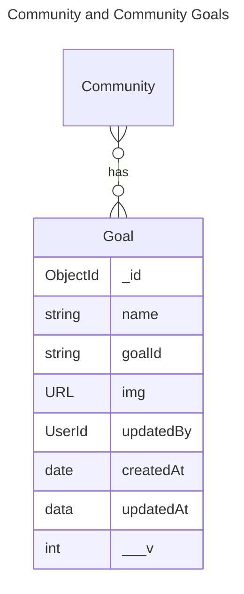
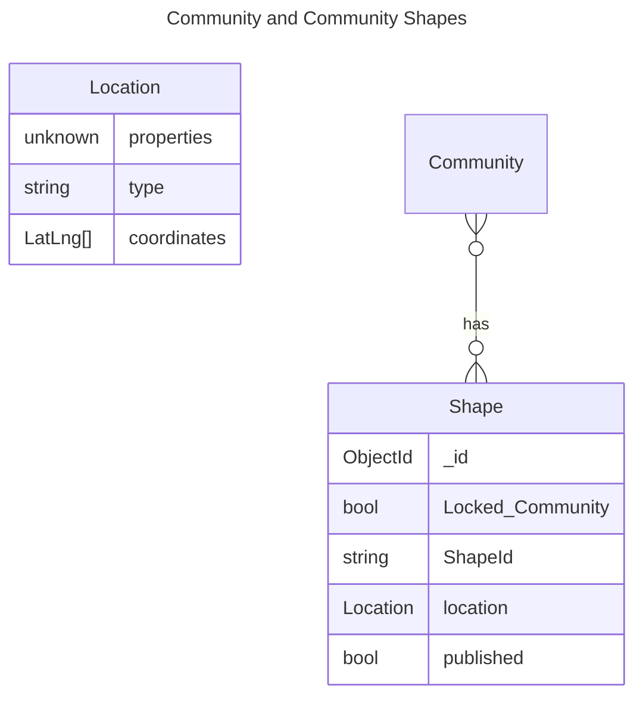

## Community ERD

This ERD captures all the relationships between communities and other entities

### Questions

1. Can a community have more than 1 president?
2. Can a community have more than 1 treasurer?

**Used generic string types for many field. If any of this has branded type in the backend code, please update them**

There are some cardinality issue depicted below with membership

