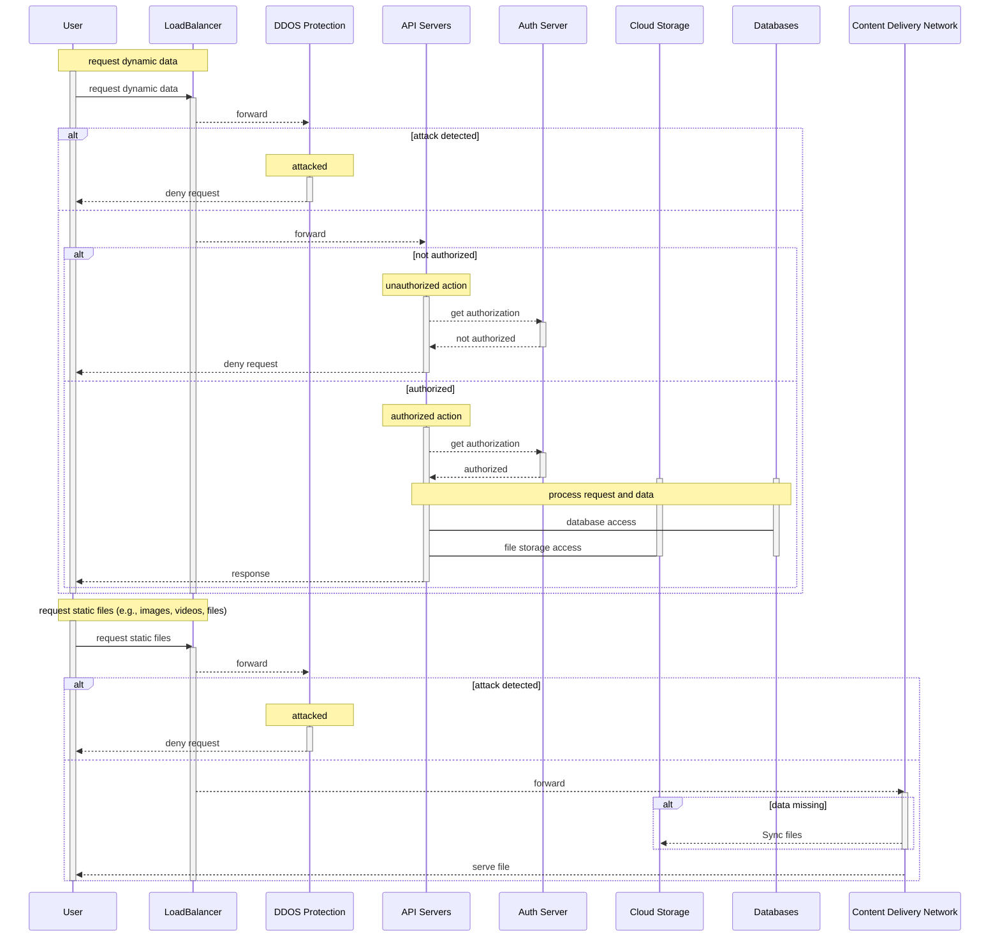

This server architecture shows the layers. There are two kinds of requests:

1. request involving dynamic data for which one needs to access the api and data
2. request involving static data only for which the content can be directly served by a CDN without accessing the API servers

