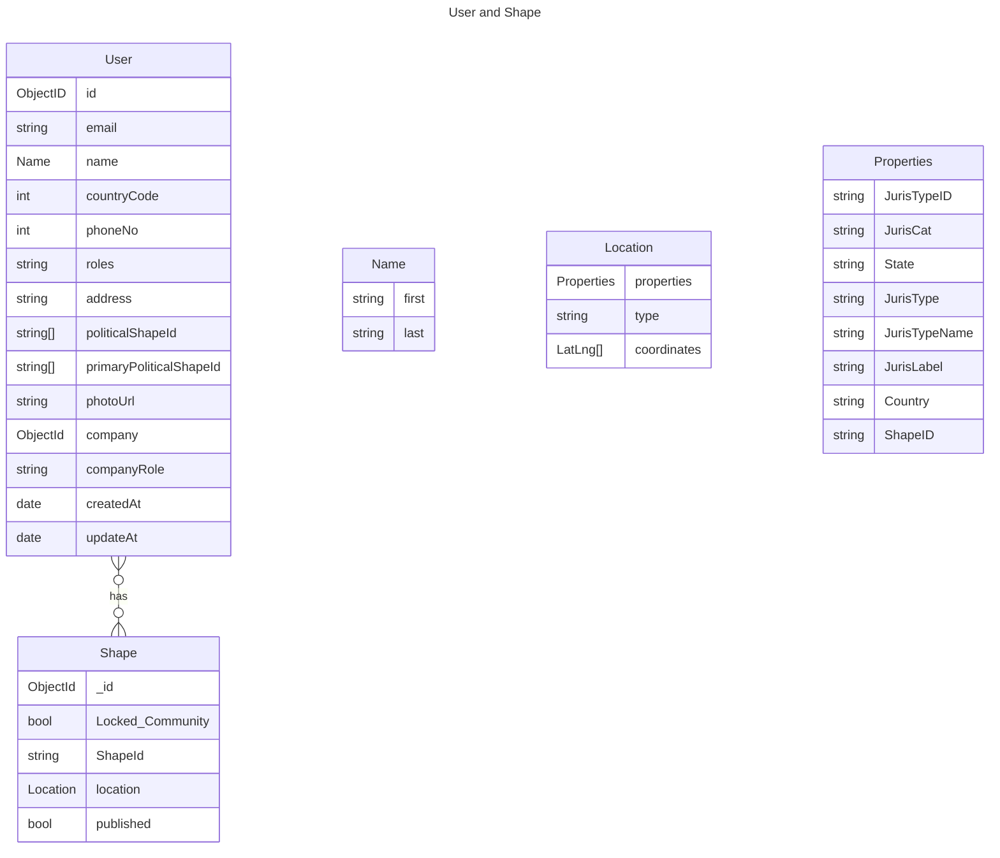
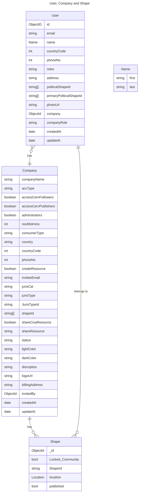
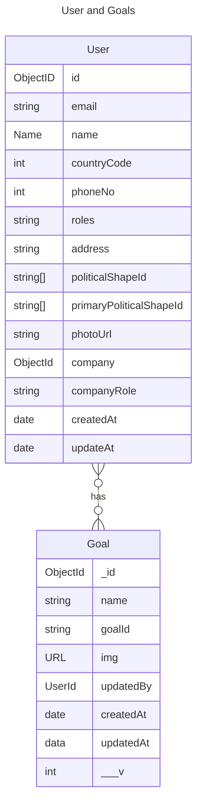

## User ERD

``` mermaid

--- 
title: User and Shape
---
erDiagram

    User {
            ObjectID id
            string email
            Name name
            int countryCode
            int phoneNo
            string roles
            string address
            string[] politicalShapeId
            string[] primaryPoliticalShapeId
            string photoUrl
            ObjectId company
            string companyRole
            date createdAt
            date updateAt

    }

    Name {
        string first
        string last
    }
    Shape {
        ObjectId _id
        bool Locked_Community
        string ShapeId
        Location location
        bool published
    }

    Location {
        Properties properties
        string type
        LatLng[] coordinates

    }

     Properties {
        string JurisTypeID
        string JurisCat
        string State
        string JurisType
        string JurisTypeName
        string JurisLabel
        string Country
        string ShapeID

     }


User o{--o{Shape : has

```

----------------------------------------

```mermaid
---
title: User, Company and Shape
---
erDiagram

 User {
            ObjectID id
            string email
            Name name
            int countryCode
            int phoneNo
            string roles
            string address
            string[] politicalShapeId
            string[] primaryPoliticalShapeId
            string photoUrl
            ObjectId company
            string companyRole
            date createdAt
            date updateAt

    }

    Name {
        string first
        string last
    }

Company {
string companyName
string accType
boolean accessCervFollowers
boolean accessCervPublishers
boolean adminstrators
int noofAdmins
string consumerType
string country
int countryCode
int phoneNo
boolean createResource
string inviteeEmail
string jurisCat
string jurisType
string JurisTypeId
string[] shapeId
boolean shareCivaResource
string shareResource
string status
string lightColor
string darkColor
string discription
string logoUrl
string billingAddress
ObjectId invitedBy
date createdAt
date updateAt
}
Shape {
        ObjectId _id
        bool Locked_Community
        string ShapeId
        Location location
        bool published
    }

User }o--|| Company : "has"
Company ||--o{ Shape :"has"
User ||--o{ Shape : "belongs to"
```

-------------------------------------------------------------------------

```mermaid
---
title: User and Goals
---
erDiagram
    Goal {
        ObjectId _id
        string name
        string goalId
        URL img
        UserId updatedBy
        date createdAt
        data updatedAt
        int ___v
    }
    User {
            ObjectID id
            string email
            Name name
            int countryCode
            int phoneNo
            string roles
            string address
            string[] politicalShapeId
            string[] primaryPoliticalShapeId
            string photoUrl
            ObjectId company
            string companyRole
            date createdAt
            date updateAt

    }
    User o{--o{ Goal: has

```