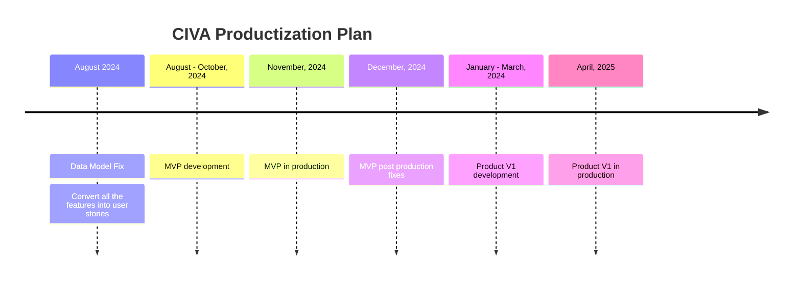

# Road Map

This road map is designed based on the following team assumptions from day 1

1. a parttime software architect
2. a fulltime senior software engineer
3. a fulltime mid-level backend software engineer
4. a fulltime mid-level react developer
5. a fulltime QA engineer
6. a parttime DevOps engineer
7. a fulltime designer

